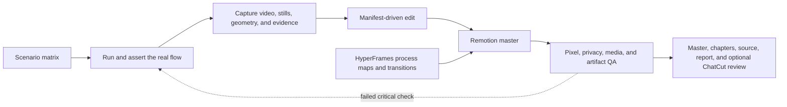

# Build Service Guide Video

[](https://github.com/SJ578Park/build-service-guide-video/actions/workflows/validate.yml)
[](LICENSE)

A reusable Codex skill for producing factual, privacy-safe product walkthroughs and operator guides from real application behavior.

This repository packages the workflow that emerged while building and revising a multi-role service guide: browser capture, business assertions, DOM-derived directions, deterministic editing, motion graphics, narration, privacy masking, exact-frame QA, and an editable review handoff.

## What makes this different

The video is treated as the final layer of a tested system. A required flow must work before it is recorded, every visual instruction is tied to evidence, and the delivered pixels are checked against the same scenario that created them.



## Tool roles

| Need | Recommended surface | Why |
|---|---|---|
| Repeatable browser interaction, raw chapter video, DOM rectangles, and assertions | [Playwright](https://playwright.dev/docs/videos) | One script can verify behavior and produce the recording manifest. |
| Stable UI assembly, masks, arrows, captions, narration, and chapter renders | [Remotion](https://www.remotion.dev/) | Frame timing and data-driven overlays stay reproducible. |
| A process map or short transition motion graphic | [HyperFrames](https://hyperframes.heygen.com/guides/rendering) | Deterministic HTML motion is useful when it improves orientation. |
| Reviewable chapter ordering and editorial handoff | ChatCut | Useful as a review surface when the master source of truth is stated explicitly. |
| A signed-in page or visual browser state that needs direct UI control | Codex Browser | Good for inspection and screenshots; follow the selected browser's current runtime documentation. |
| A native desktop app or UI that has no browser/API automation surface | Computer Use | Good for accessibility-driven actions and screenshots; pair it with a separate recorder when continuous video is required. |

Read [Screen capture and computer-control surfaces](references/screen-capture-surfaces.md) before capturing through Codex Browser, Computer Use, Playwright, or an OS recorder.

## Install as a Codex skill

```bash
git clone https://github.com/SJ578Park/build-service-guide-video.git \
  ~/.codex/skills/build-service-guide-video
```

Restart Codex so the skill is discovered, then invoke it with a concrete service and outcome:

```text
Use $build-service-guide-video to create a 1080p Korean operator guide for the
deployed service. Cover the admin and instructor handoff, show both pass and
fail outcomes, and deliver chapter renders plus a validation report.
```

The skill can also be used as a standalone reference without installing it. Start with [SKILL.md](SKILL.md) and load only the references required for the current production mode.

## Initialize a production workspace

Node.js 20 or newer is sufficient for the included dependency-free helpers.

```bash
node scripts/init-guide-workspace.mjs \
  --out /absolute/path/to/video-guide \
  --name "Service Operator Guide"
```

The initializer creates a scenario matrix, issue log, manifest example, and directories for raw recordings, verified stills, narration, evidence, reports, and renders. It never imports application-specific data.

Validate one manifest or a directory of chapter manifests:

```bash
node scripts/validate-guide-manifest.mjs \
  --manifest /absolute/path/to/video-guide/manifests
```

Extract exact review frames from a render:

```bash
node scripts/extract-review-frames.mjs \
  --input /absolute/path/to/master.mp4 \
  --times 0,8.5,42.2 \
  --out /absolute/path/to/review-frames
```

## Core guarantees

- Critical product failures stop recording; edits never fabricate a successful outcome.
- A guide step records the route or app, stable before/after evidence, action time, target geometry, privacy intent, and narration.
- UI directions appear only after the captured UI is stable.
- Privacy masks are scoped to measured fields and time windows; raw assets, logs, and manifests are scanned too.
- Remotion is normally the final render source of truth. HyperFrames and ChatCut have deliberately narrower roles.
- Functional state, final artifacts, pixels, codec, duration, chapters, and editable handoff are all validated.

## Repository layout

```text
.
├── SKILL.md
├── agents/openai.yaml
├── assets/                  # Generic workspace templates and examples
├── references/              # Conditional workflow details and case study
└── scripts/                 # Initializer, manifest validator, and frame review helpers
```

Run the repository checks with:

```bash
npm test
```

## Origin

The rules in this skill were distilled from a real four-chapter operator-guide production. The first version combined browser recordings with a Remotion edit. The later version added per-step manifests, stable before/after stills, DOM-derived geometry, a HyperFrames overview, privacy lifecycle tests, deployment verification, exact-frame render checks, and a ChatCut review timeline.

The sanitized lessons and the reasons behind the main rules are in [Case study: from raw recording to a tested guide](references/case-study.md). No customer media, credentials, private URLs, or application source code are included here.

## License

MIT. See [LICENSE](LICENSE).
